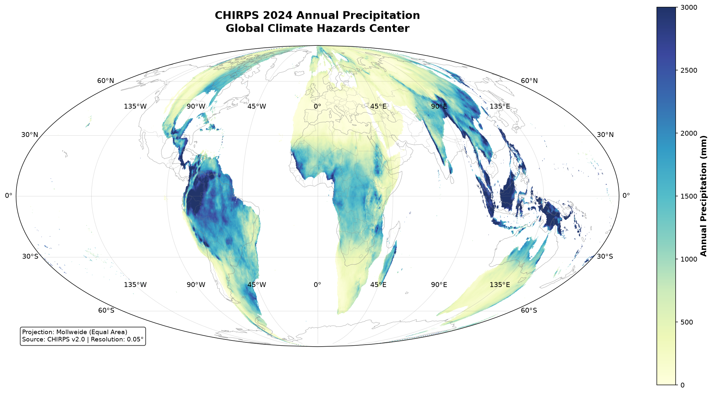

# CHIRPS Precipitation Analysis: Global Climate Data Visualization

A complete tutorial for downloading, processing, and visualizing global precipitation data from the CHIRPS dataset using Python, with cloud-optimized GeoTIFF conversion and multi-year comparative analysis.



## 📚 Overview

This project demonstrates:
- **Data Download**: Downloading CHIRPS v2.0 precipitation data
- **Cloud Optimization**: Converting GeoTIFF to Cloud-Optimized GeoTIFF (COG)
- **Data Validation**: Using `rio-cogeo` to validate COG compliance
- **Geospatial Analysis**: Processing and analyzing raster data with Rasterio
- **Scientific Visualization**: Creating publication-quality maps with Equal Earth projection
- **Time Series Analysis**: Comparing precipitation patterns across multiple years (2022-2024)

## 🌍 What You'll Learn

1. **Setting up a geospatial Python environment** with `uv` package manager
2. **Downloading and validating** satellite precipitation data
3. **Converting to Cloud-Optimized GeoTIFF format** for cloud storage
4. **Processing large raster datasets** efficiently
5. **Creating publication-quality maps** with Cartopy
6. **Analyzing temporal precipitation patterns** across years
7. **Understanding geographic projections** (Equal Earth, Equirectangular, etc.)

## 🚀 Quick Start

### Prerequisites
- Python 3.10+ (Windows, macOS, or Linux)
- 5 GB disk space for data
- Internet connection

### Installation

1. **Clone this repository:**
```bash
git clone https://github.com/yourusername/chirps-precipitation-analysis.git
cd chirps-precipitation-analysis
```

2. **Install UV package manager:**
```bash
pip install uv
# or on Windows PowerShell:
# curl -LsSf https://astral.sh/uv/install.ps1 | powershell -c -
```

3. **Install project dependencies:**
```bash
uv sync
```

## 📖 Tutorial Structure

### 1. **Step 1: Data Download and Validation** (`01_download_and_validate.py`)
Learn how to:
- Download CHIRPS v2.0 global annual precipitation data
- Validate GeoTIFF structure
- Understand data metadata

```bash
uv run python 01_download_and_validate.py
```

**Output:**
- `chirps-v2.0.2024.tif` - Original GeoTIFF file
- Validation report showing compliance issues

---

### 2. **Step 2: Cloud Optimization** (`02_convert_to_cog.py`)
Learn how to:
- Convert regular GeoTIFF to Cloud-Optimized GeoTIFF (COG)
- Add internal overviews for fast zooming
- Reorder metadata for cloud efficiency

```bash
uv run python 02_convert_to_cog.py
```

**Output:**
- `chirps-v2.0.2024_cog.tif` - Cloud-optimized version
- Validation report confirming COG compliance

---

### 3. **Step 3: Data Exploration** (`03_explore_data.py`)
Learn how to:
- Load and inspect raster metadata
- Calculate global precipitation statistics
- Identify min/max/mean values

```bash
uv run python 03_explore_data.py
```

**Output:**
- Statistical summary of precipitation data
- Data shape, CRS, and geographic bounds

---

### 4. **Step 4: Single Year Visualization** (`04_visualize_single_year.py`)
Learn how to:
- Create publication-quality maps
- Use scientific colormaps (YlGnBu)
- Add geographic labels (latitude/longitude)
- Apply proper projections

```bash
uv run python 04_visualize_single_year.py
```

**Output:**
- `chirps_2024_map.png` - Professional precipitation map

---

### 5. **Step 5: Multi-Year Comparison** (`05_compare_years.py`)
Learn how to:
- Download and process multiple years of data
- Calculate year-over-year changes
- Create side-by-side comparison maps
- Generate difference maps (wetter/drier regions)

```bash
uv run python 05_compare_years.py
```

**Output:**
- `chirps_comparison_2022_2024_equalearth.png` - 3-year comparison
- `chirps_difference_maps_equalearth.png` - Change analysis
- `chirps_trend_chart.png` - Trend visualization

---

### 6. **Step 6: Regional Analysis** (`06_extract_region.py`)
Learn how to:
- Extract data for specific geographic regions
- Create regional precipitation statistics
- Focus on countries or continents

```bash
uv run python 06_extract_region.py
```

**Output:**
- Regional precipitation statistics
- Country-specific analysis

---

## 📊 Key Findings (2022-2024)

| Year | Mean Precipitation | Change from Previous |
|------|-------------------|---------------------|
| 2022 | 898.06 mm | — |
| 2023 | 853.70 mm | -4.94% ↓ |
| 2024 | 887.43 mm | +3.95% ↑ |

**Observations:**
- Slight dip in global precipitation in 2023
- Recovery in 2024 with precipitation returning to 2022 levels
- Monsoon patterns clearly visible over South Asia and Central Africa

## 🛠️ Technology Stack

| Tool | Purpose |
|------|---------|
| **Python 3.10+** | Programming language |
| **UV** | Fast package manager |
| **Rasterio** | Read/write GeoTIFF files |
| **Rio-cogeo** | Cloud-optimized GeoTIFF tools |
| **Cartopy** | Geographic plotting |
| **Matplotlib** | Visualization |
| **NumPy** | Numerical computing |

## 📦 Project Structure

```
chirps-precipitation-analysis/
├── README.md                          # This file
├── CHIRPS_VISUALIZATION_CONTEXT.md   # Important notes & requirements
├── pyproject.toml                     # Project dependencies
│
├── 01_download_and_validate.py       # Download & validate data
├── 02_convert_to_cog.py              # Convert to COG
├── 03_explore_data.py                # Explore statistics
├── 04_visualize_single_year.py       # Single year map
├── 05_compare_years.py               # Multi-year comparison
├── 06_extract_region.py              # Regional analysis
│
├── data/                              # Data storage (created automatically)
│   ├── chirps-v2.0.2022.tif
│   ├── chirps-v2.0.2023.tif
│   └── chirps-v2.0.2024.tif
│
└── output/                            # Generated visualizations
    ├── chirps_2024_map.png
    ├── chirps_comparison_2022_2024_equalearth.png
    ├── chirps_difference_maps_equalearth.png
    └── chirps_trend_chart.png
```

## 🎨 Visualization Features

### Colormaps Used
- **YlGnBu**: Yellow (dry) → Green → Blue (wet) - for precipitation
- **RdBu_r**: Red (wetter) → White → Blue (drier) - for differences

### Projections Used
- **Equal Earth**: Equal-area projection, accurate continent sizes
- **Equirectangular**: Standard lat/lon grid (simple, no distortion)
- **PlateCarree**: Standard geographic projection

### Map Features
- Coastlines and country borders
- Geographic gridlines with lat/lon labels
- Color bars with units
- Statistical annotations

## 📚 Key Concepts

### Cloud-Optimized GeoTIFF (COG)
A GeoTIFF optimized for cloud storage and fast access:
- Metadata at file start (quick access)
- Internal tiling (efficient reading)
- Internal overviews (fast zooming)
- Designed for cloud services (S3, Google Cloud, Azure)

### CHIRPS Dataset
- **Source**: CHISCO - Climate Hazards Center, UC Santa Barbara
- **Resolution**: 0.05° (~5.5 km)
- **Coverage**: Global (-180° to 180°, -50° to 50°)
- **Variable**: Annual precipitation (mm)
- **URL**: https://data.chc.ucsb.edu/products/CHIRPS-2.0/

### Geographic Projections
- **Equal Earth**: Recommended for global data (preserves area)
- **Mollweide**: Also equal-area, oval shape
- **Mercator**: Distorts areas (Greenland appears huge!)
- **Equirectangular**: Simple lat/lon grid

## 🐛 Troubleshooting

### Issue: "gdal-bin not found"
**Windows users:** Use WSL2 or install via `pip install GDAL --only-binary :all:`

### Issue: Cartopy gridline errors
**Solution:** Avoid `draw_labels=True` with Equal Earth projection; use manual text labels instead

### Issue: Large file sizes
**Solution:** Files are ~300 MB each. Use subsampling for faster processing: `data[::2, ::2]`

### Issue: "scipy or pykdtree not found"
**Solution:** Run `uv add scipy pykdtree`

## 🔗 Related Resources

- **CHIRPS Data**: https://www.chc.ucsb.edu/data/chirps
- **Cartopy Documentation**: https://scitools.org.uk/cartopy/
- **Rasterio**: https://rasterio.readthedocs.io/
- **Cloud-Optimized GeoTIFF**: https://www.cogeo.org/
- **Equal Earth Projection**: https://equal-earth.com/

## 📝 Notes for Users

### Windows Users
- **Recommended**: Use Windows Subsystem for Linux 2 (WSL2) for geospatial work
- Alternative: Use Google Colab (no installation needed)
- Works on Command Prompt with `uv` and Python 3.10+

### macOS/Linux Users
- All tools work out of the box
- Install via Homebrew if preferred: `brew install gdal`

### Large Dataset Handling
- Full global datasets are ~300 MB each
- Use subsampling for faster plotting: `data[::4, ::4]` (every 4th pixel)
- Consider regional extraction for smaller data volumes

## 🤝 Contributing

Contributions welcome! Please:
1. Fork the repository
2. Create a feature branch
3. Make improvements
4. Submit a pull request

Suggested improvements:
- [ ] Add Jupyter Notebook versions
- [ ] Create interactive Streamlit dashboard
- [ ] Add more regions (India, Africa, etc.)
- [ ] Add precipitation anomaly analysis
- [ ] Create drought/flood detection models

## 📄 License

MIT License - feel free to use this for learning and research

## 👤 About

Created as a tutorial for geospatial data analysis and climate science visualization.

**Author**: Somdeep Kundu, Mumbai, India

## 📧 Contact & Questions

For questions or suggestions, please open an Issue on GitHub.

---

**Last Updated**: August 2026
**Data Cutoff**: August 2024
**Python Version**: 3.10+

## 🌟 Star History

If you find this useful, please star the repository!

---

## Recommended Learning Path

1. **Beginner**: Steps 1-3 (understand data)
2. **Intermediate**: Step 4 (create maps)
3. **Advanced**: Steps 5-6 (analysis & comparison)

Start with Step 1 and progress sequentially! 🚀
